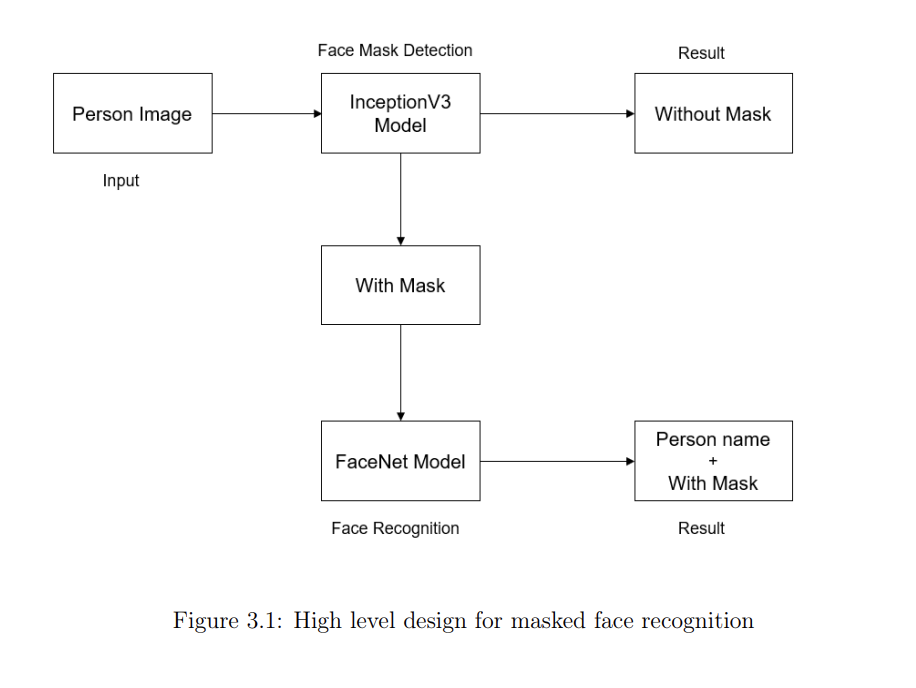
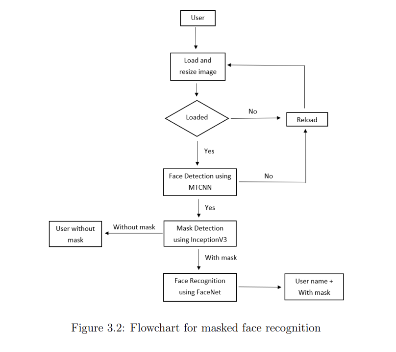
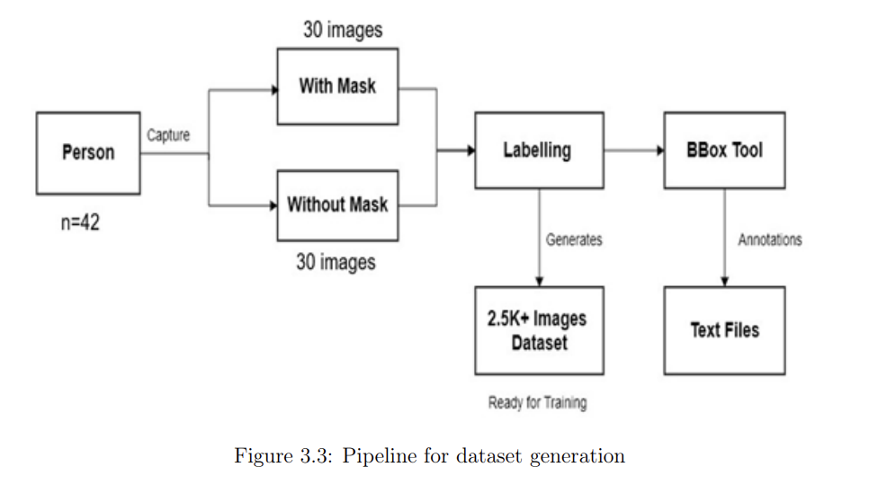
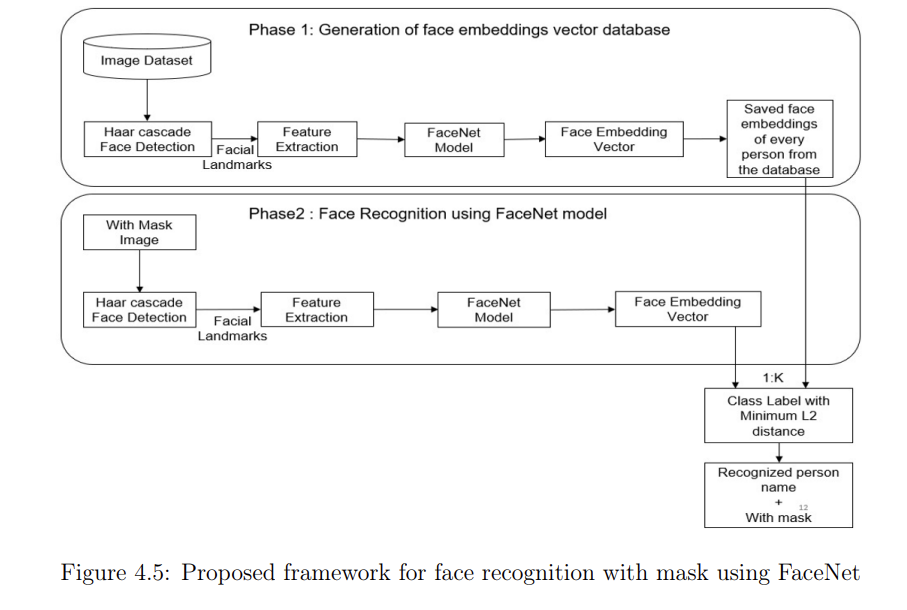
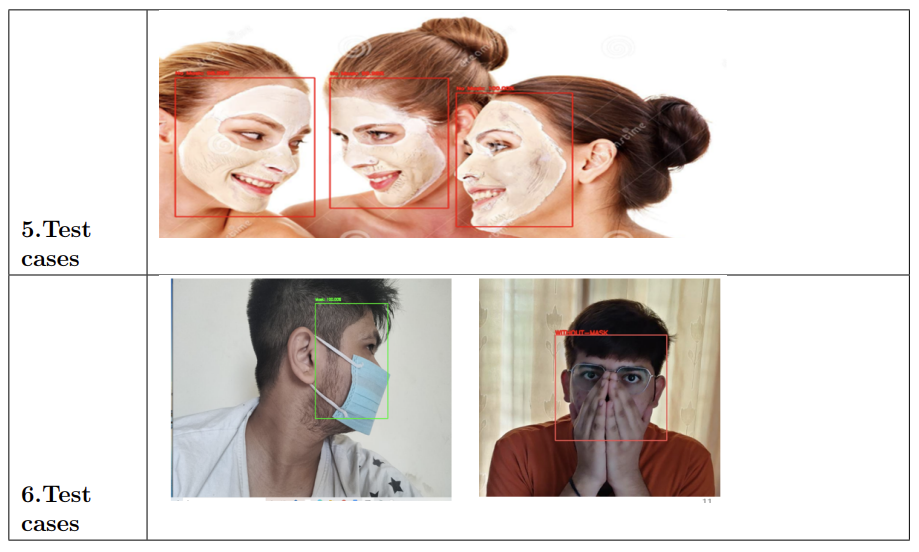
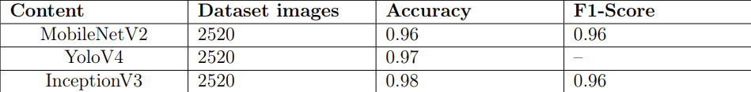
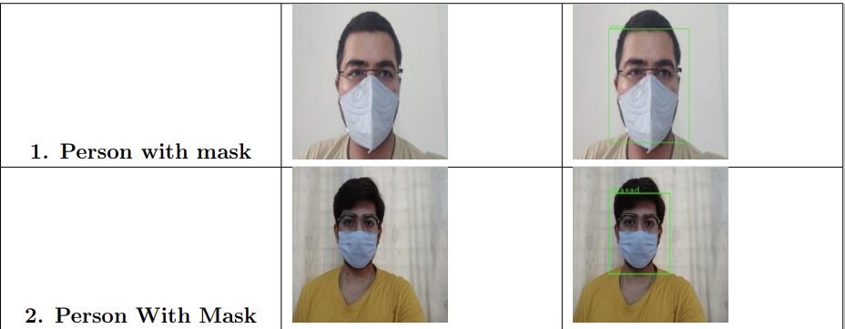

# Masked-Face-Recognition

In this new era where we are experiencing a pandemic, people are advised to wear masks to protect themselves and to reduce the spread of the coronavirus. In this case, masked face
recognition is a very difficult task since certain face parts are hidden. A primary focus is to bring up a rapid and efficient solution to address this problem. Since the majority of the
systems are ineffective for this new constraint of face recognition with mask technique have been less effective and inaccurate in recognizing masked face recognition which is essential
for face authorization or authentication for wide-region tracking for security and surveillance, facilitating secure payments, contact tracing of Covid-19 suspects, etc.
In our work, we propose a framework for an efficient masked face recognition, initially a face mask is detected and then the facial feature-based extraction is performed for identifying
the masked person using his/her face. Using this framework, we can detect people wearing or not wearing masks in public places and recognize the person and authenticate accurately,
this would be helpful in increasing the safety measures.

## Framework for the masked face recognition

The architecture of the proposed model is mainly based on 2 modules. Those are Face detection along with mask detection and face recognition. This is attained using Deep CNNbased models namely InceptionV3 and FaceNet. In the proposed system MTCNN (Multi-Task
Cascaded Convolutional Neural Network ) is used for face detection along with InceptionV3 for mask detection. The inceptionV3 was used for mask detection as it is good for training smallsized datasets with higher accuracy. The major module in the proposed architecture is the
Face Recognition module. Face recognition can be done using various models namely FaceNet, VGG, and Deep Face models. In this system, FaceNet was used in the Face Recognition
module.

Advantages of FaceNet :

 - FaceNet can identify similar faces having different facial expressions and angles(facial
expressions).
 - FaceNet can handle various lighting conditions, occlusions and transformations efficiently.
 - This model can identify the same faces despite the person have markings on their face.
 - The model can recognize the individual correctly when half of the face was cut off.
 - Action sequences where the person face is highly different can still be matched in the
FaceNet model.

The InceptionV3 and FaceNet Models were then combined on the constraint that only the
masked faces must be recognized.

## Workflow of the proposed system

 The user will give input by uploading the image on the website/web interface. If the input image is properly loaded then general pre-processing will be done like resizing and re-scaling
after that, if the face of the person is present in the input image then the image passes through the MTCNN model where the model detects the face of the person. Then the image is sent to
the InceptionV3 model for face mask detection, if a mask is present in the right place on the face of the person then the InceptionV3 model passes this image to the FaceNet model where
the person face recognition is done based on the comparison between vector embeddings taken from this input image with vector embeddings present within the database. The workflow of
the proposed system is shown in Figure 3.2.

## Dataset Generation and Pre-processing

Image dataset generation is a process of collecting images of various individuals with different angles and postures. Dataset generation is carried out to train a built model which when
implemented gives the needed result. The dataset available on the web are not so relevant to train the face recognition model in the best way, so we have generated our own dataset
according to our model needs, which is further used for model training and testing. Since the data was not sufficient enough to train the model we have used data augmentation as a
pre-processing technique to meet the requirements.

## Face Recognition with mask

Face recognition with mask is a process of identifying or verifying the identity of a person based on their face from a digital image. It is used to recognise people from images, videos
or in real-time. Face recognition with mask can be divided mainly into three categories namely face detection, feature extraction and lastly feature matching. And the output of each
method will be the input to the next method. 

Face recognition with mask is a complex task which relies majorly on eigenvectors. The traditional or early methods [8] for implementing face recognition model used PCA for feature
extraction and Feed Forward back propagation neural networks for recognition. Latter on for small training set examples and for large categories the Similarity metrics [9] was being used
for recognition and verification. Now there are modern techniques or methods for implementing face recognition such as DeepFace [10], which employ a four-stage pipeline that follows
the flow of, detect, align, represent and classify. This model has an advanced approach since it is combined with 3-D face modelling and piecewise affine transformation to achieve the task
of face recognition. VGGFace is another neural network model that can be used for face recognition with mask model, where a 2048 vector dimensional descriptor face embedding is
produced. Then these are L2 normalized and using the cosine distance the similarity between the faces is calculated. FaceNet [13] maps the face images extracted to the Euclidean
space that in turn will generate 128-Dimensional vector embeddings as a measure of similarity. To increase the efficiency and achieve good results, a novel online mining triplet technique was
introduced. FaceNet has attained good accuracy with more reliable results on face recognition benchmark datasets. Therefore, after going through various academic literature papers, publications and blogs, the FaceNet model is chosen for implementing the Masked Face Recognition
part. 
 

FaceNet is a face recognition model which is introduced by Google researches by integrating machine learning in processing face recognition. It is also known as one-shot learning
model. FaceNet gives unified embedding for face verification, recognition and clustering tasks. It directly trains the face by mapping each face image into the Euclidean space where the distance consists of facial model similarities. FaceNet training method uses triplet loss that helps
in minimizing the gap of anchor and positive, and maximizes the gap of anchor and negative image. FaceNet uses deep convolutional networks to optimize its embedding, and fetches 128
vector embeddings as a feature extractor. FaceNet is trained using training face thumbnails ranging from 100M to 200M, which consist of 8M different identities with varying input size
from 96x96 pixels to 224x224 pixels. It is widely used in cases where there is scarcity of dataset, and still it attains a good accuracy. 

## Results 
### Results for face mask detection

For face mask detection, we are using InceptionV3 model and we got accuracy for this model as 98%. and the results obtained for various cases are shown below.

- Comparison of different models for face mask detection:
 - MobileNetV2
 - YoloV4
 - InceptionV3
 

### Results for face recognition

For face recognition, FaceNet is used to give us accurate results. The accuracy obtained through FaceNet model is better as compared to other models . And the results obtained for
various cases are shown in the following tables. 

## CONCLUSION AND FUTURE SCOPE

We have proposed a framework for masked face recognition model. A dataset containing 2520 images of 42 individuals was generated. An InceptionV3 model is being used in the
proposed architecture to obtain better results for face mask detection which when compared to other CNN models i.e. YOLOv4 and MobileNetV2 gave better accuracy. FaceNet model
is used for face recognition with mask. As FaceNet is a one-shot learning model which is preferred majorly in case where there is scarcity of datasets and still the model obtains good
accuracy. As the dataset generated contains few images and since those are masked faces, the extracted features are also less, so FaceNet model best suits to this condition. These models
i.e. InceptionV3 and FaceNet were then combined to form the high level architecture of the system, based on the constrain that only masked faces must be considered for recognition. 

The model can be further fine tuned to improve the accuracy and recognize the multiple faces present in the image. Our work can be extended to authenticate people at public places such
as airports, offices, hospitals, schools, etc., to ensure that the safety standards are maintained and people abide by the rules and regulations.

